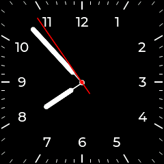

# AnalogClock
Tasmota LVGL smooth moving analog clock written in berry
<div>

</div>

## Installation
Download the Tasmota appication file (AnalogClock.tapp) and upload it to your Tasmota device under Tools / Manage File System menu.

To build manually, execute following in the repo directory:
```
rm -f AnalogClock.tapp; zip -j -0 AnalogClock.tapp src/*.be
```
## Configuration
Following parameter could be configured in the `persist` module:

`clock_round_face` - boolean (default: false): round or rectangular clock face

`clock_width` - integer (default: screen_width)

`clock_height` - integer (default: screen_height)

`clock_face_font` - string (default: undefined) - .ttf font file to use for the digits (should be uploaded in the file system)

`clock_mirrored` - boolean (default: false): should the clock be mirrored (the font shoudl also be mirrored)

By default the embeded montserrat font is used. Depending on the build type only limited sizes are available (10, 14, 20, 28).
Use LVGL build or define `USE_LVGL_FREETYPE` to use custom .ttf files.

Example:
```
import persist
persist.clock_mirrored = false
persist.clock_face_font = 'Vera.ttf'
persist.clock_round_face = false
persist.clock_width = 240
persist.clock_height = 240
persist.save()
```
